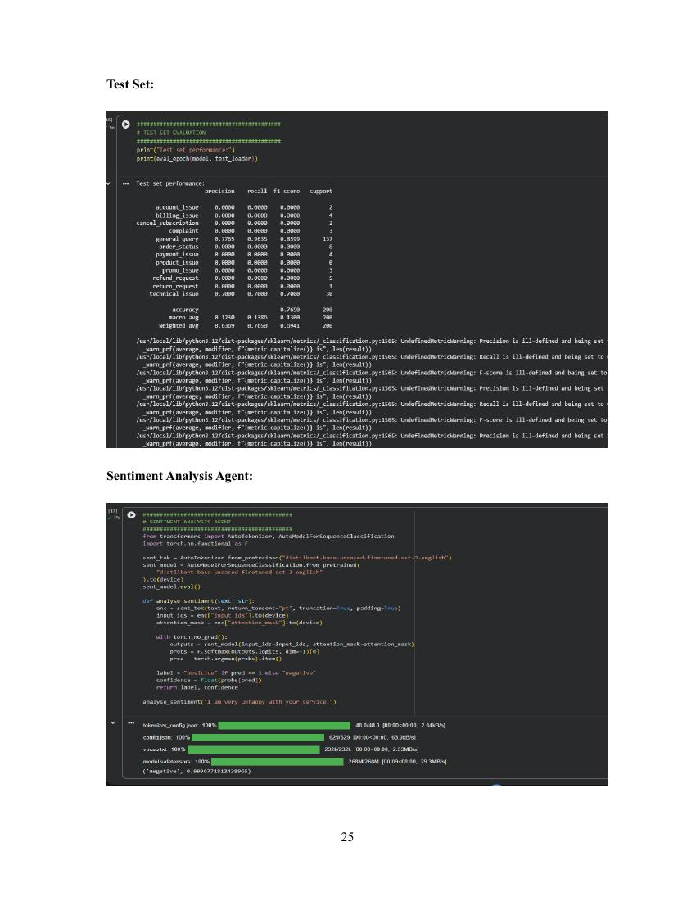
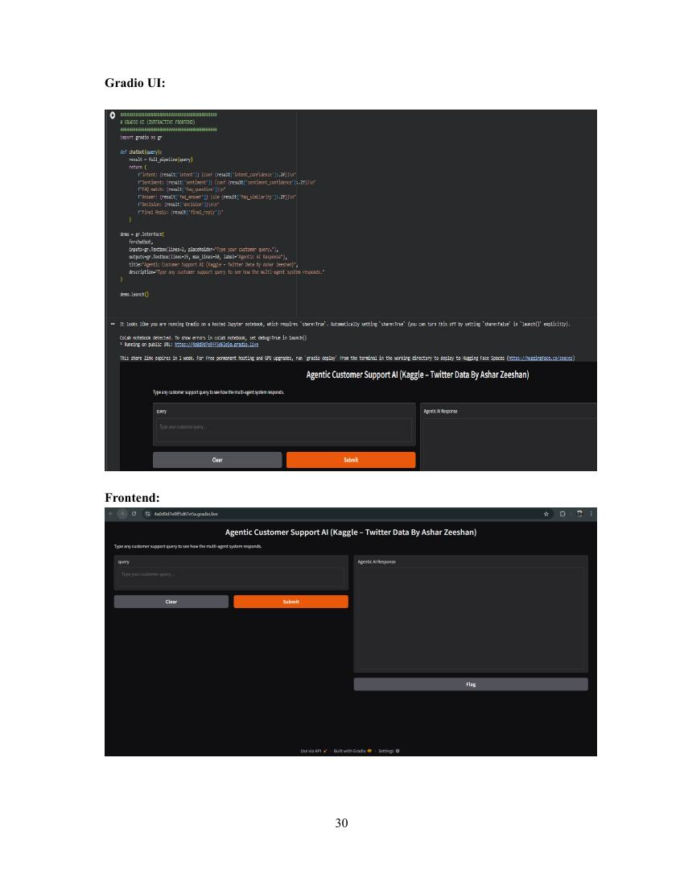

# Agentic Customer Support AI — Multi-Agent Intelligent System

A multi-agent AI system that automates customer support triage: classifies intent, analyses sentiment, retrieves the best-matching FAQ answer, and decides whether to auto-resolve a query or escalate it to a human agent. Built for the Intelligent Systems coursework, MSc Artificial Intelligence, University of East London.

## Overview
Large organisations receive high volumes of repetitive customer support queries (login issues, refunds, delayed orders). This project explores an **agentic, multi-agent pipeline** — rather than one black-box model — where each agent handles a distinct task and can be inspected, debugged, or improved independently. The system is trained and evaluated on a sample of the Kaggle "Customer Support on Twitter" dataset, and exposed through an interactive Gradio interface.

## Architecture

```
User Query → Intent Classifier Agent → Sentiment Analysis Agent → Knowledge Retrieval Agent → Decision Agent
                                                                                                      ├── Auto-resolve → Automated FAQ Response
                                                                                                      └── Escalate → Human Support Ticket
```

| Agent | Role | Model | Output |
|---|---|---|---|
| **Intent Classifier** | Identifies the purpose of the message (e.g. `refund_request`, `account_issue`, `billing_issue`) | Fine-tuned BERT (`bert-base-uncased`) | Intent label + confidence |
| **Sentiment Analysis** | Detects whether the message tone is positive or negative | DistilBERT (SST-2) | Sentiment label + confidence |
| **Knowledge Retrieval (FAQ)** | Finds the closest matching FAQ answer via semantic similarity, even with different wording | Sentence-Transformers (`all-MiniLM-L6-v2`) | Best-matching FAQ answer + similarity score |
| **Decision Agent** | Rule-based logic combining the above to decide auto-resolve vs. escalate | Rule-based | `auto_resolve` / `escalate` |

**Decision rule:** auto-resolve if intent confidence > 0.75 **and** FAQ similarity > 0.60 **and** sentiment is not negative; otherwise escalate to a human agent.

## Tech Stack
- **Language:** Python 3.10 (Google Colab, GPU-accelerated)
- **Deep Learning:** PyTorch, HuggingFace Transformers, Sentence-Transformers
- **Interface:** Gradio
- **Data handling:** Pandas, NumPy, scikit-learn

## Dataset
- [Kaggle "Customer Support on Twitter"](https://www.kaggle.com/datasets/thoughtvector/customer-support-on-twitter) — real customer support messages
- Filtered to inbound (customer-authored) messages, sampled to 2,000 entries
- Intent labels generated via rule-based keyword mapping (13 intent classes, e.g. `refund_request`, `account_issue`, `technical_issue`, `general_query`)
- Split: 72% train / 18% validation / 10% test (stratified)

## Results

The intent classifier reached **76.5% overall test accuracy**, but this headline number hides a significant class imbalance problem worth calling out directly:

| Class | Precision | Recall | F1 | Support |
|---|---|---|---|---|
| `general_query` | 0.78 | 0.96 | 0.86 | 137 |
| `technical_issue` | 0.70 | 0.70 | 0.70 | 30 |
| All other classes (`account_issue`, `billing_issue`, `refund_request`, `payment_issue`, etc.) | 0.00 | 0.00 | 0.00 | 1–13 each |

**Why:** the dataset sample was dominated by `general_query` and `technical_issue` (163 of 200 test examples), leaving most other intents with only a handful of training examples — too few for the model to learn to distinguish them. The model effectively defaulted to predicting the majority classes.

This is a genuine and useful finding: it shows the pipeline architecture and individual agents (sentiment, FAQ retrieval, decision logic) work correctly, but the intent classifier needs a better-balanced training set (or class-weighted loss / oversampling) to generalise across all intent categories — a clear, concrete direction for future improvement.



## Example Run

**Input:** *"I can't access my account."*

| Step | Output |
|---|---|
| Intent | `account_issue` (confidence 0.91) |
| Sentiment | `negative` (confidence 0.88) |
| FAQ match | "I can't log in to my account." → *"Please use the 'Forgot Password' option to reset your credentials."* (similarity 0.79) |
| Decision | **Escalate** (negative sentiment overrides a strong FAQ match) |
| Final reply | "Your issue has been escalated to a human support agent. You will be contacted soon." |

This example shows the sentiment-aware escalation logic in action — even with a confident intent match and a strong FAQ answer, a frustrated tone routes the query to a human.

## Interface
A Gradio web interface lets a user type any support query and see the full agent-by-agent breakdown (intent, sentiment, FAQ match, decision, final reply) in real time.



## Key Takeaways
- A modular multi-agent design makes each processing step transparent and independently improvable — a clear advantage over single-model "black box" approaches
- Incorporating sentiment into the decision logic allows the system to route frustrated customers to humans even when the intent/FAQ match is strong
- Semantic (embedding-based) FAQ retrieval handles paraphrased queries that keyword matching would miss
- Class imbalance in the training data is the main limitation — addressing this (via stratified sampling, class weighting, or a larger/more balanced dataset) is the clearest next step

## Repository Contents
```
├── notebooks/
│   └── agentic_customer_support.ipynb   # Full pipeline: data prep, training, agents, Gradio UI
├── report/
│   └── Intelligent_Systems_Report.pdf
├── results/                              # Workflow diagrams, UI screenshots, evaluation results
├── requirements.txt
└── README.md
```

## How to Run
1. Open `notebooks/agentic_customer_support.ipynb` in Google Colab (recommended — GPU support) or Jupyter
2. Install dependencies: `pip install -r requirements.txt`
3. You'll need a free [Kaggle account](https://www.kaggle.com/) and API token (`kaggle.json`) to download the dataset — the notebook prompts for this
4. Run all cells in order. The final cell launches the Gradio interface with a shareable link

## References
- Lee, H., Kim, S., and Park, J. (2022). *Intelligent chatbots for customer support.* Applied Sciences, 12(4), 4112.
- Vaswani, A. et al. (2017). *Attention is all you need.* NeurIPS, 30, 5998–6008.
- Google AI Blog (2018). *BERT: Pre-training of deep bidirectional transformers for language understanding.*
- Kaggle. *Customer Support on Twitter* dataset.

## Author
Neha 
